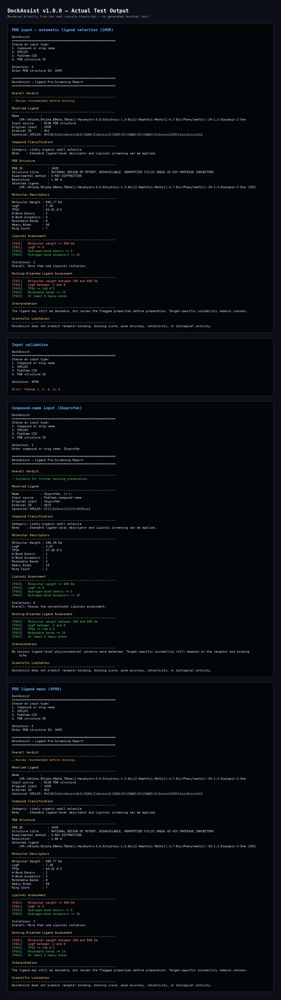

# DockAssist

DockAssist is a Python command-line tool for pre-screening small-molecule ligands before molecular docking. It supports compound names, SMILES, PubChem CIDs and PDB structure IDs, calculates molecular descriptors using RDKit, evaluates Lipinski's Rule of Five, and provides a ligand-level assessment.



## Features

- Compound name, SMILES, PubChem CID and PDB structure ID input
- Automatic ligand retrieval from PubChem and the RCSB Protein Data Bank
- Molecular descriptor calculation
- Lipinski's Rule of Five assessment
- Docking-oriented physicochemical screening
- PDB structure metadata retrieval
- Human-readable terminal reports

## Installation

```bash
pip install -r requirements.txt
```

## Usage

```bash
python DockAssist.py
```

Choose an input type:

```text
1. Compound or drug name
2. SMILES
3. PubChem CID
4. PDB structure ID
```

## Origin

DockAssist was developed following my undergraduate dissertation:

**Docking Reproducibility: Vina, Smina and GOLD Compared**

The project was created to streamline ligand pre-screening tasks commonly performed before molecular docking.

DockAssist was created to make computational chemistry more accessible. During my studies, I found that many tools and tutorials assumed prior knowledge and were difficult for beginners to approach. DockAssist aims to bridge that gap by providing clear, visual, and educational ligand pre-screening without paywalls or unnecessary complexity.

📄 Dissertation:
https://github.com/benjaminkamya/Undergraduate-Dissertation 

## Technologies

- Python
- RDKit
- PubChem
- RCSB Protein Data Bank

## Scientific Limitations

DockAssist is a ligand pre-screening tool. It does **not** perform molecular docking or predict binding affinity, docking scores, binding poses, selectivity, or biological activity.

## License

Released under the MIT License.
